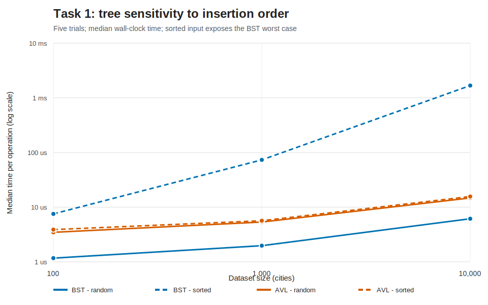
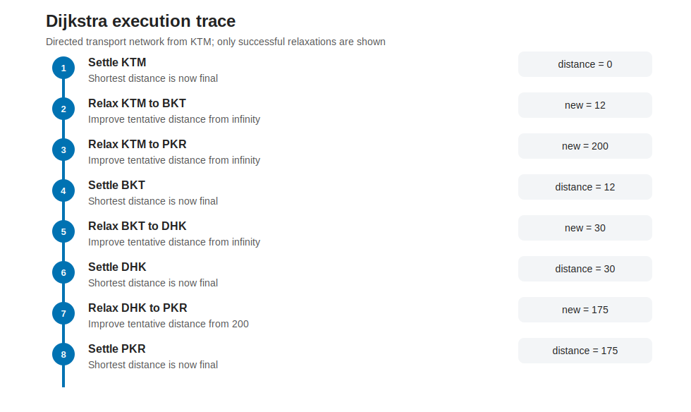
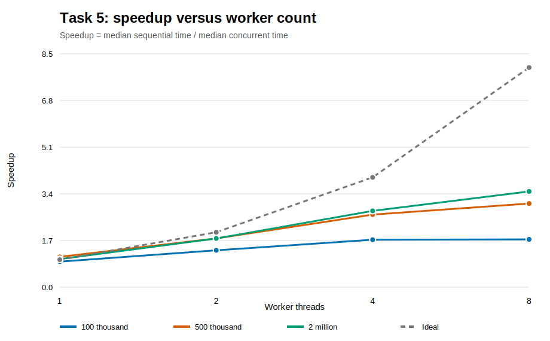

# ST5003CEM Advanced Algorithms Coursework

**Student ID:** 240678  
**Implementation languages:** Python 3.11+ and Java 17

## 1. Introduction and Method

This coursework designs, implements, and evaluates data structures and algorithms for route planning,
transport optimisation, scheduling, resource allocation, and concurrent sorting. The central method is
to connect theoretical complexity with reproducible wall-clock evidence without treating Big-O as a
direct prediction of seconds. All generated datasets use fixed seeds. Timings use monotonic
high-resolution clocks, warm-up where appropriate, five trials, and medians. Raw CSV measurements are
retained, and each timed solution is checked for correctness or structural invariants.

The implementations are divided into five independent task packages. A test suite covers ordinary,
boundary, invalid, adversarial, and reference-comparison cases. Detailed method notes and limitations
are available in the task reports; this report integrates the principal decisions and findings.
Complexity notation and the standard graph and scheduling algorithms follow Cormen et al. (2022).

## 2. Advanced Data Structures

A validated `City` record stores name, coordinates, population, and route distance. Four independent
structures index these records:

- an unbalanced binary search tree (BST) ordered by case-folded city name;
- an AVL tree with stored heights and single/double rotations;
- an array-backed min-heap ordered by distance and then name;
- a separate-chaining hash table with deterministic FNV-1a hashing and resizing.

BST insertion, search, and deletion are O(log n) on average but O(n) when the tree degenerates. AVL
guarantees O(log n) for these operations, paying constant costs for height maintenance and rotations.
Heap insertion and minimum extraction are O(log n), with O(1) minimum access, but arbitrary name
search/deletion is O(n). Hash operations are expected O(1) and worst-case O(n); resize-triggering
insertion is O(n), making ordinary insertion only amortised constant time.

Tests use 100, 1,000, and 10,000 cities in random and sorted order. At 10,000 random cities, median
insertion cost was approximately 6.14 microseconds for BST, 14.74 for AVL, 1.29 for heap, and 5.91 for
hashing. AVL is slower than a well-shaped BST because its stronger guarantee requires extra work.
However, sorted BST insertion increased to 1.68 milliseconds per item, about 273 times its random-input
cost, and its height became 10,000. AVL remained near 15 microseconds because rotations preserved
logarithmic height.

For exact-name lookup, hashing is the general choice; AVL is preferable when ordered iteration or
range operations are also required. For repeated nearest-city extraction, the heap is appropriate.
A real route planner may combine a hash index with a heap because identity lookup and priority access
are different abstractions. Figure 1 presents the decisive order-sensitivity result.



## 3. Graph Algorithms and Pathfinding

The transport network uses a weighted directed adjacency list. Sparse city networks connect each
vertex to a small fraction of all cities, so O(V + E) storage is more appropriate than an O(V squared)
matrix. Directed edges represent asymmetric travel costs. Prim is defined for undirected graphs;
therefore it accepts only an explicit undirected graph or a documented projection that keeps the
minimum reciprocal connection.

Dijkstra uses a binary heap and runs in O((V + E) log V). It rejects negative weights and records
settlement and successful-relaxation events. Bellman-Ford runs in O(VE), permits negative weights,
stops early after an unchanged pass, reconstructs a reachable negative-cycle witness, and marks every
downstream distance as undefined. Prim uses the cut property to construct an O((V + E) log V) minimum
spanning forest, explicitly reporting disconnected components.

Sparse and dense graphs with 50, 100, and 200 vertices were tested. On sparse 200-vertex graphs,
median runtime was 1.48 ms for Dijkstra, 2.33 ms for Bellman-Ford, and 1.04 ms for Prim. On dense
graphs it was 5.95, 11.29, and 6.27 ms respectively. Prim uses the undirected projection, so its edge
count is recorded separately. Runtime divided by the relevant growth expression was also recorded as
an observed constant-factor proxy. It is descriptive rather than a shared “operation”: early exit and
a simple loop give Bellman-Ford a small per-VE value despite its larger total runtime.

Dijkstra is best for non-negative shortest routes, Bellman-Ford when negative costs or cycle detection
are required, and Prim for minimum-cost undirected infrastructure. Dense graphs may favour
array-based O(V squared) variants because heap constants grow with E. Algorithm traces make each
semantic difference visible.



## 4. Algorithmic Strategies

### 4.1 Dynamic programming

Weighted job scheduling sorts jobs by finish time. Let `p(i)` be the last job ending no later than job
`i` starts. With `OPT(0)=0`, the recurrence is:

```text
OPT(i) = max(profit(i) + OPT(p(i)), OPT(i - 1))
```

Binary search finds compatible prefixes; a bottom-up table stores decisions and reconstructs the
schedule. Sorting dominates the O(n log n) time, while the table uses O(n) space. An O(2^n)
exhaustive solver validates small cases. At 16 jobs, exhaustive search required about 101 ms while DP
required about 0.024 ms and returned the same optimum.

### 4.2 Greedy strategy

Weighted interval heuristics select earliest finish, shortest duration, or highest profit. Earliest
finish is optimal when weights are equal: replacing an optimal solution’s first interval with the
earliest-finishing compatible interval cannot reduce later choices, and the exchange repeats.
Arbitrary weights break that proof. Intervals `(0,2,4)`, `(0,3,10)`, and `(2,4,4)` cause earliest
finish to earn 8 while DP earns 10. A finite search automatically discovers counterexamples for all
three rules. Greedy construction is fast, but measured non-zero optimality gaps confirm that local
choice is not an exact method.

### 4.3 Backtracking

Exam timetabling assigns `(slot, room)` values to exam vertices. Conflicting exams cannot share a
slot, rooms cannot be double-booked, and capacity must cover enrolment. A loose worst-case bound is
O((slots × rooms)^exams). The improved solver uses minimum-remaining-values ordering, degree
tie-breaking, least-constraining values, forward checking, and slot-symmetry breaking. These do not
remove the exponential worst case, but on an infeasible eight-exam single-room instance they reduced
explored placements from 13,699 to 7.


## 5. NP-Hard Problem and Heuristics

Multi-dimensional bin packing assigns CPU, RAM, and bandwidth demands to minimum-capacity server bins.
It is NP-hard by restriction from one-dimensional bin packing: map each original size to CPU demand,
give every item unit RAM/bandwidth, and set those two bin capacities to the number of items. Only CPU
can constrain placement, so solving the restricted three-dimensional problem solves the original.
This restriction follows the classical NP-completeness framework of Garey and Johnson (1979).

The first heuristic is dominant-share best-fit decreasing, with O(n squared) worst-case placement.
The second applies whole-bin relocations and feasible swaps to reduce bin count and resource
imbalance. An exponential branch-and-bound reference certifies small instances using a greedy upper
bound, dimension-wise volume lower bound, ordering, and symmetry pruning.

A four-item case exposes greedy non-optimality: greedy uses three bins, while relocation and exact
search use two. On a 12-item trial, greedy used seven and local/exact used six. Computation is not
always rewarded: for 100 items, greedy took about 2.1 ms and local search about 1.49 seconds, yet both
used 48 bins. Local search is justified when saving a server has sufficient value; greedy is preferable
under a strict latency budget. Larger results are compared with lower bounds but are not labelled
optimal without exact certification.

## 6. Concurrent Programming

Sequential and concurrent bottom-up merge sort perform O(n log n) work and use O(n) auxiliary space.
A fixed Java worker pool has a shared task queue and pending counter protected by `ReentrantLock`.
`workAvailable` wakes workers, `allDone` creates a pass barrier, and `join` ensures clean shutdown.
Within a pass, workers read one immutable source array and write disjoint destination ranges, so data
arrays need no lock. Tasks batch multiple merges to reduce lock contention. Lock and condition
semantics follow the Java 17 concurrency specification (Java Platform, 2021).

All benchmark outputs are compared element-for-element with a trusted sorted reference. Datasets of
100,000, 500,000, and 2,000,000 values run with 1, 2, 4, and 8 workers. At two million values, median
time fell from approximately 233 ms sequentially to 228, 131, 84, and 67 ms respectively. Eight
workers achieved 3.49 times speedup and 44% efficiency.

Efficiency declines because of queue synchronisation, thread lifecycle, cache coherence, memory
bandwidth, uneven task division, and the final pass containing only one merge. Amdahl’s law therefore
prevents linear scaling. Small inputs can slow down because coordination exceeds saved computation.



## 7. Experimental Validity and Reproducibility

The evaluation separates correctness, theoretical growth, and observed performance. Correctness is
established through several mechanisms rather than timing successful termination. Tree, heap, and
hash implementations expose invariant audits. Shortest paths and schedules reconstruct concrete
solutions. Random small scheduling instances are cross-checked with exhaustive search. Packing
feasibility is independently recalculated, and small bin-packing objectives are certified by
branch-and-bound. Concurrent outputs are compared against a trusted full ordering. These checks are
important because a fast incorrect algorithm has no useful performance result.

Fixed seeds make instances repeatable, while multiple trials reveal timing variation. Medians reduce
the influence of isolated pauses, but they do not eliminate bias from runtime compilation, allocation,
cache state, frequency scaling, background activity, or operating-system scheduling. Therefore,
absolute nanosecond and millisecond values describe the test machine, not every machine. The stronger
conclusions concern trends: sorted order damages BST shape; heap identity search grows linearly;
density increases graph work; exhaustive scheduling diverges from DP; pruning removes search states;
local search costs more than greedy construction; and larger sorting inputs amortise thread overhead.

Benchmark fairness also requires semantic care. Prim answers an undirected infrastructure question,
not directed shortest paths, so its projected edge count is reported. Heap removal by city name
includes a linear identity scan and is not confused with logarithmic root extraction. Bellman-Ford
performs additional negative-edge and cycle-detection work that Dijkstra does not. The exact
bin-packing solver is omitted at large sizes rather than stopped early and presented as optimal.
Likewise, a resource-volume lower bound is labelled a bound because incompatible item combinations
may make the true optimum higher.

Constant factors are discussed beside Big-O throughout. String normalisation, hashing, rotations,
object allocation, heap operations, condition signalling, cache locality, and memory bandwidth are
real work hidden by asymptotic notation. Dividing runtime by a complexity expression provides a useful
within-algorithm diagnostic, but the resulting “units” are not equivalent instructions across
algorithms. This prevents the common error of using O(n log n) as a wall-clock forecast.

All raw measurements, generation seeds, test commands, figure generators, and detailed task reports
are stored with the implementation. Figures are generated from the CSV files rather than manually
entered values. A repository-wide check validates test suites, CSV row counts, concurrency correctness
flags, SVG metadata, report links, integrated word count, and repository naming requirements. The
remaining limitations are synthetic data, one machine, five timing trials, and relatively small exact
instances. Real road networks, university enrolment conflicts, heterogeneous servers, repeated
process-level runs, confidence intervals, and memory profiling would improve external validity.

## 8. Conclusion

The experiments support workload-specific decisions. Stronger asymptotic guarantees can carry visible
constants, heuristics exchange certainty for speed, pruning improves practical exponential search
without changing its worst case, and concurrency helps only after work amortises coordination.
Correctness checks, raw data, traces, and limitations make these conclusions reproducible and avoid
claiming that Big-O alone predicts wall-clock performance.

## References

Cormen, T.H., Leiserson, C.E., Rivest, R.L. and Stein, C. (2022) *Introduction to Algorithms*. 4th
edn. MIT Press.

Garey, M.R. and Johnson, D.S. (1979) *Computers and Intractability: A Guide to the Theory of
NP-Completeness*. W.H. Freeman.

Java Platform, Standard Edition 17 API Specification (2021) `java.util.concurrent.locks`.
