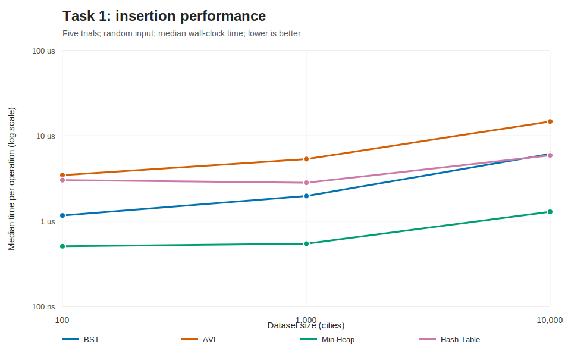
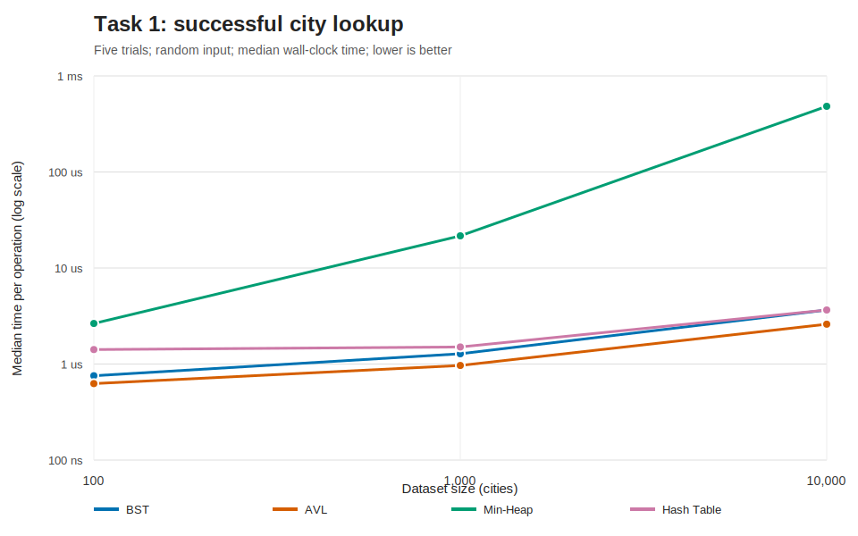
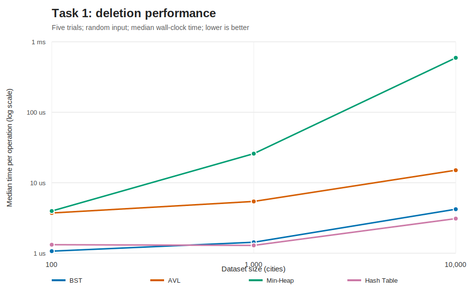

# Task 1 - Advanced Data Structures

## Route-Planning Model

Each structure stores an immutable `City` record containing a name, latitude, longitude, population,
and distance. Names are normalised with Unicode-aware case folding, so `Kathmandu` and `KATHMANDU`
address the same tree or hash-table entry. Coordinates, population, and distance are validated before
storage. This keeps invalid domain data out of every structure.

The four implementations are intentionally independent:

- `BinarySearchTree` provides ordered lookup without balancing.
- `AVLTree` adds rotations and stored heights to guarantee balance.
- `MinHeap` prioritises the next city by `(distance, name)`.
- `CityHashTable` uses separate chaining, deterministic FNV-1a hashing, and dynamic resizing.

## Theoretical Complexity

| Structure | Insert | Search | Delete | Priority access | Important hidden work |
|---|---:|---:|---:|---:|---|
| BST, average | O(log n) | O(log n) | O(log n) | O(n) | String comparisons at every visited node |
| BST, worst | O(n) | O(n) | O(n) | O(n) | Pointer chasing through a degenerate chain |
| AVL Tree | O(log n) | O(log n) | O(log n) | O(n) | Height updates and up to two rotations |
| Min-Heap | O(log n) | O(n) | O(n) by name | O(1) peek, O(log n) extract | Array swaps and a linear scan for name operations |
| Hash Table, expected | O(1) amortised | O(1) | O(1) | O(n) | Hashing the full key, chain scan, occasional resize |
| Hash Table, worst | O(n) | O(n) | O(n) | O(n) | All keys can occupy one collision chain |

Big-O describes growth, not seconds. It deliberately omits constants such as object allocation,
case-folding and string comparison, AVL height maintenance, hash computation, cache locality, and
interpreter overhead. Consequently, the simple BST can beat the AVL tree on small or well-shaped
inputs even though the AVL tree has the stronger worst-case bound. Hash insertion is amortised O(1),
but a particular insertion that triggers resizing is O(n).

Separate chaining was selected over open addressing because deletion is straightforward, load factors
above one remain valid, and collision behaviour is directly measurable. FNV-1a replaces the language
runtime's randomised string hash so bucket statistics are reproducible.

## Experimental Method

The benchmark generates synthetic cities at the three required sizes: 100, 1,000, and 10,000. A fixed
seed (`240678`) makes every record and query reproducible. Each configuration is run five times.
Measurements use a monotonic, high-resolution wall clock and report the median nanoseconds per
operation. Raw totals are retained as well.

Two insertion orders are tested:

1. Random order approximates an ordinary mixed workload.
2. Sorted order is an adversarial but realistic case, such as importing an alphabetically sorted file.

Every built structure is audited. Trees report height, the heap checks its parent-child invariant, and
the hash table reports its longest collision chain. Successful and unsuccessful lookup are separated
because they can traverse different amounts of a structure. Deletion uses up to 1,000 sampled names.

The benchmark measures one process on one machine; it is not a universal hardware ranking. Background
load, memory allocation, timer resolution, cache state, and runtime implementation can change absolute
times. Repetition and medians reduce noise but do not remove it.

## Results



For 10,000 randomly ordered cities, median insertion cost was approximately 6.14 microseconds for the
BST, 14.74 microseconds for AVL, 1.29 microseconds for the heap, and 5.91 microseconds for the hash
table. AVL's extra comparisons, height updates, and rotations produce a visible constant-factor cost.
Heap insertion is especially cache-friendly because it operates on a contiguous list.



At 10,000 cities, AVL, BST, and hash lookup remained in the low-microsecond range. Heap name lookup
rose to approximately 483 microseconds because a priority heap is not a name index and must scan
linearly. This result is a practical example of choosing a structure for an access pattern rather than
declaring one structure universally fastest.



Named deletion from the heap also includes a linear search, making it much slower as `n` grows. The
tree and hash structures are appropriate when deletion is identified by city name. Heap root
extraction remains O(log n); the measured named-removal workload is deliberately a different
operation and is labelled accordingly in the raw data.


Sorted input is the decisive tree experiment. At 10,000 cities, BST insertion rose from about 6.14
microseconds per operation on random input to 1.68 milliseconds on sorted input, roughly 273 times
larger. Its recorded height becomes 10,000. AVL insertion stayed near 15 microseconds because rotations
preserved logarithmic height. The experiment supports the theoretical prediction while also showing
that the prediction alone does not provide the observed factor.

## Use-Case Decisions

### Frequent inserts

Use the hash table when cities are usually accessed by name and order is irrelevant. Its expected
constant-time operations provide the best general mapping behaviour. Use the heap instead when each
inserted city's distance will soon be used for priority extraction. The unbalanced BST is acceptable
only when input order is controlled or simplicity is more important than worst-case latency.

### Frequent lookups

Use the hash table for exact name lookup. Use AVL when sorted iteration, range queries, predecessor, or
successor operations are also required. The AVL constant factor buys predictable O(log n) latency and
resistance to adversarial ordering.

### Priority access

Use the min-heap for repeatedly selecting the nearest city. `peek` is O(1), and insertion/extraction is
O(log n). Do not use it as the only city-name index. A production route planner would often combine a
heap with a hash table: the heap handles priority while the table handles identity lookup.

## Critical Evaluation

The structures solve different abstractions. A fair conclusion is therefore workload-specific:

- AVL improves latency predictability at the cost of extra work on every update.
- BST performance depends on shape, making its average-case result fragile.
- Hash-table expected O(1) behaviour depends on distribution, resizing policy, and bounded chain
  lengths; its worst case remains linear.
- Heap performance is excellent for its minimum element but poor for arbitrary identity search.

The experiment could be strengthened with memory profiling, larger datasets, mixed read/write traces,
real place names of varying lengths, and confidence intervals. It could also compare a heap augmented
with a name-to-index map, which improves named updates at the cost of additional synchronisation after
every swap.

## Reproduction

```powershell
$env:PYTHONPATH='src'
python -m unittest discover -s tests -p 'test_*.py' -v
python experiments/task1_benchmark.py --trials 5
python experiments/task1_figures.py
```

The complete raw evidence is stored in `experiments/data/task1_benchmarks.csv`.
