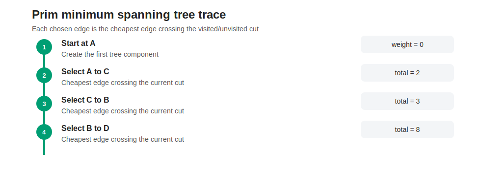
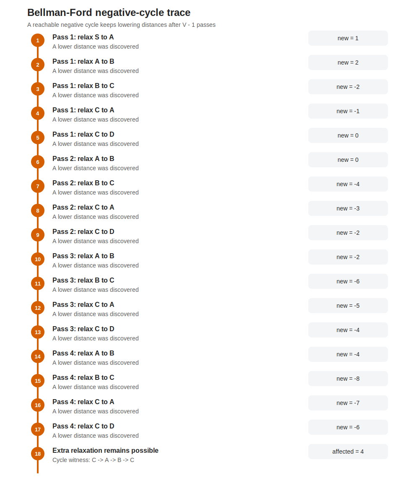
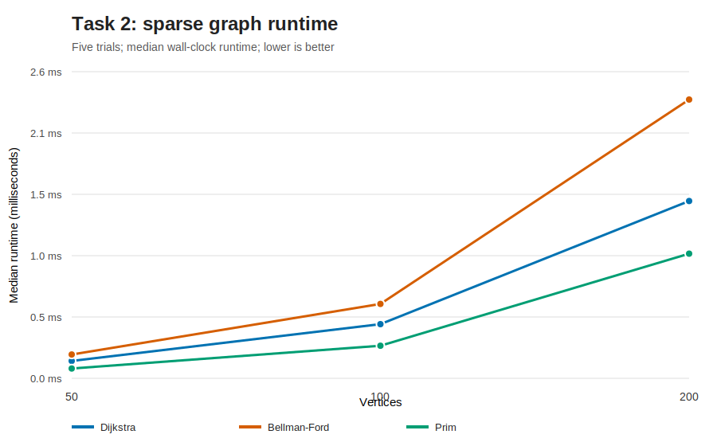
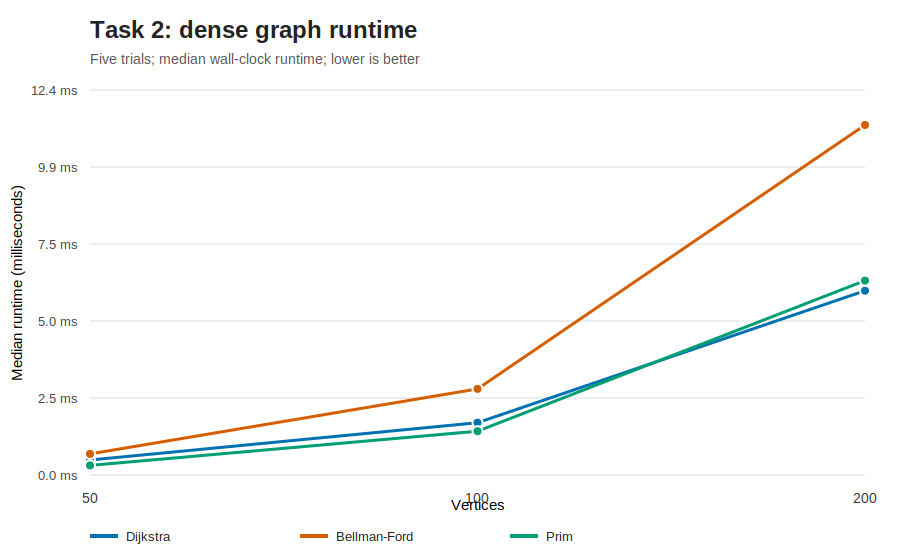

# Task 2 - Graph Algorithms and Pathfinding

## Graph Representation

The transport network is represented by a weighted adjacency list:

```text
vertex -> {neighbour: edge weight, ...}
```

A city network is normally sparse: each city connects directly to a small subset of all cities.
Accordingly, an adjacency list uses O(V + E) space and iterates only over existing outgoing roads.
An adjacency matrix uses O(V squared) space and scans V possible neighbours even when most edges do
not exist. A matrix could be preferable for a genuinely dense graph or constant-time edge-existence
queries, but it is not the best default for this route-planning model.

The main network is directed because travel time or cost can differ by direction. Prim's algorithm is
defined for undirected graphs, so it is not silently run on directed arcs. The implementation requires
an undirected graph. A documented projection converts reciprocal directed arcs into one undirected edge
using the minimum weight; this means the MST answers a network-design question, not the original
one-way routing question.

## Algorithms

### Dijkstra

Dijkstra maintains tentative distances in a binary min-heap. Settling the smallest tentative vertex is
safe only when all edge weights are non-negative, so the implementation rejects a graph containing a
negative edge. Stale heap entries are skipped instead of using a decrease-key operation.

- Time: O((V + E) log V)
- Space: O(V + E)
- Best use: non-negative single-source routes, especially sparse graphs


The trace distinguishes settling from relaxation. A relaxation is recorded only when it improves a
distance, and predecessor links reconstruct the final path.

### Prim

Prim repeatedly selects the cheapest edge crossing from the visited set to an unvisited vertex. The
cut property proves that this choice is safe for a minimum spanning tree. A disconnected input returns
a minimum spanning forest, making the lack of full connectivity explicit.

- Time: O((V + E) log V)
- Space: O(V + E)
- Best use: minimum-cost undirected network construction



Negative edges are valid for Prim because it compares edges rather than path totals. This differs from
Dijkstra's non-negative requirement.

### Bellman-Ford

Bellman-Ford relaxes every reachable edge up to V - 1 times. If another relaxation is possible, a
reachable negative cycle exists. The implementation reconstructs one concrete cycle and then traverses
outward to mark every vertex whose shortest distance is undefined. An unreachable negative cycle is
correctly ignored for the selected source.

- Time: O(VE) worst case
- Space: O(V)
- Best use: graphs with negative edges or where negative-cycle detection is required



Early termination stops when a complete pass makes no change. This optimisation does not change the
worst-case bound but strongly affects observed runtime.

## Empirical Comparison

Graphs of 50, 100, and 200 vertices were generated at target directed densities of 0.05 (sparse) and
0.35 (dense). A bidirectional backbone makes every vertex reachable from vertex zero. Weights are
positive for a valid three-algorithm runtime comparison. Five deterministic trials are timed with a
monotonic high-resolution wall clock, and medians are reported. Raw measurements include vertex and
edge counts, actual density, runtime, trace-event count, and nanoseconds per theoretical complexity
unit.



On the 200-vertex sparse graph, median times were approximately 1.48 ms for Dijkstra, 2.33 ms for
Bellman-Ford, and 1.04 ms for Prim. Prim works on the undirected projection, so its edge count is
recorded separately rather than implying an identical workload.



At 200 dense vertices, Dijkstra took about 5.95 ms, Bellman-Ford 11.29 ms, and Prim 6.27 ms. All
algorithms become slower as E grows. Bellman-Ford shows the largest absolute cost, but it also provides
capabilities the other algorithms do not.

The observed constant is calculated as runtime divided by the algorithm's stated growth expression:
`(V + E) log2(V)` for heap-based Dijkstra and Prim, and `VE` for Bellman-Ford. It is a descriptive
normalisation, not proof of complexity. At 200 dense vertices the medians were about 55 ns per unit for
Dijkstra, 71 ns per unit for Prim, and 4 ns per VE unit for Bellman-Ford. These numbers cannot be
compared as though a "unit" were the same machine instruction. Bellman-Ford's early exit and simple
inner loop explain why its per-VE proxy is small even though total runtime is larger.

## Suitability and Limitations

| Requirement | Dijkstra | Prim | Bellman-Ford |
|---|---|---|---|
| Directed shortest paths | Yes | No | Yes |
| Minimum spanning tree | No | Yes, undirected only | No |
| Negative edges | No | Yes | Yes |
| Detect negative cycles | No | Not applicable | Yes |
| Sparse graph | Excellent | Excellent | Acceptable when required |
| Dense graph | Heap overhead grows with E | Heap overhead grows with E | O(VE) becomes costly |

For dense graphs, array-based O(V squared) versions of Dijkstra or Prim can compete with heap-based
versions because they avoid heap constants while E approaches V squared. That alternative is not
implemented because the selected representation targets sparse transport networks, but it is an
important limitation of any blanket claim that the heap implementation is always fastest.

The synthetic benchmark controls density and reachability but does not reproduce geographic degree
distributions, traffic correlations, or floating-point measurement error from real data. Stronger
future evaluation would use a real road network, confidence intervals, memory profiling, and repeated
process-level runs.

## Reproduction

```powershell
$env:PYTHONPATH='src'
python -m unittest discover -s tests -p 'test_*.py' -v
python experiments/task2_benchmark.py --trials 5
python experiments/task2_figures.py
```

Raw measurements are stored in `experiments/data/task2_benchmarks.csv`.
