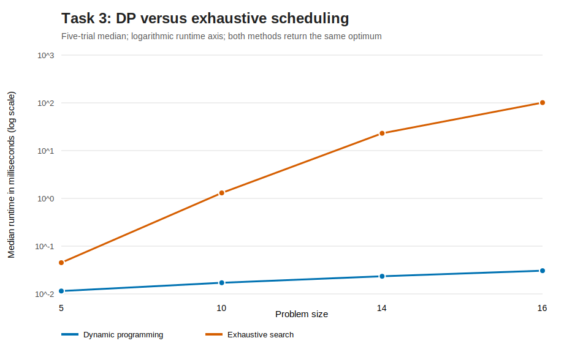
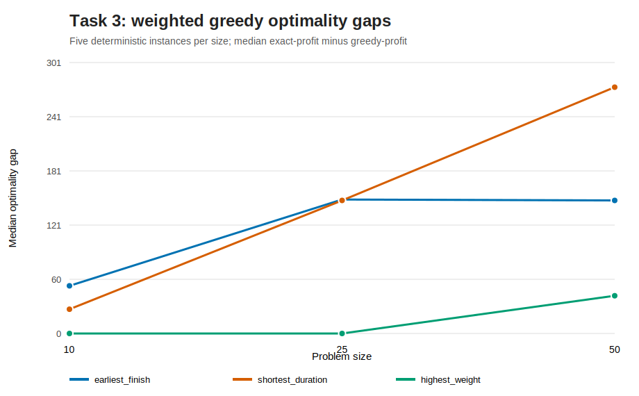
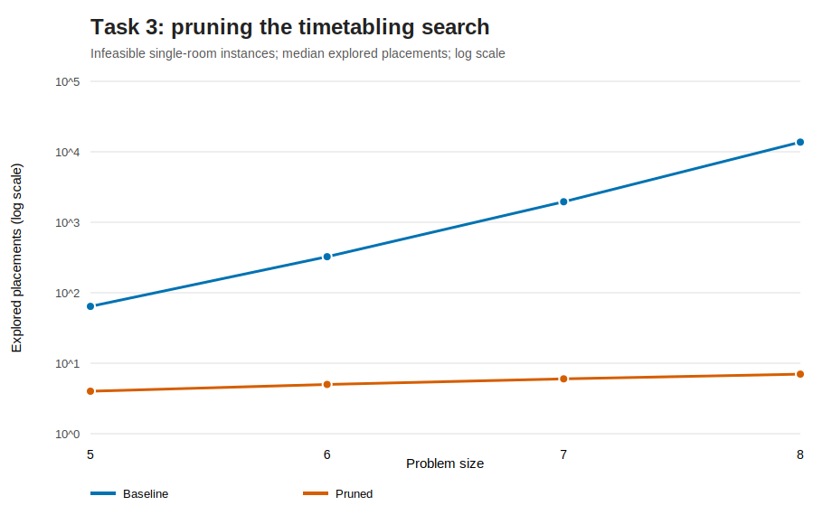

# Task 3 - Algorithmic Strategies for Complex Problems

## Dynamic Programming: Weighted Job Scheduling

### Problem and subproblems

Each job has a start time, end time, and profit. The objective is to select non-overlapping jobs with
maximum total profit. Jobs that touch at an endpoint are compatible.

Sort jobs by finish time. For job `i`, let `p(i)` be the last earlier job whose finish time is no later
than job `i`'s start. Let `OPT(i)` be the maximum profit obtainable from the first `i` sorted jobs, with
`OPT(0) = 0`. The recurrence is:

```text
OPT(i) = max(
    profit(i) + OPT(p(i)),
    OPT(i - 1)
)
```

The first branch includes job `i`, so it adds the best compatible prefix. The second excludes it.
Binary search computes every `p(i)`. A bottom-up table records each decision, and predecessor indices
reconstruct the chosen schedule.

Sorting and compatibility searches take O(n log n); the DP and reconstruction take O(n). Total time is
O(n log n), and space is O(n). Hidden costs include sorting tuples, binary-search comparisons, table
allocation, and reconstruction. An already finish-sorted input could reduce preparation to O(n), but
the implementation does not assume that precondition.

An exhaustive O(2^n) reference solver validates small cases. Thirty deterministic random tests confirm
identical optimal profit.



Across five trials, exhaustive runtime grows from roughly 0.04 ms at 5 jobs to around 100 ms at 16,
while DP remains around hundredths of a millisecond. Absolute times are machine-specific, but the
diverging growth pattern supports the theoretical distinction.

## Greedy: Weighted Interval Scheduling

Three plausible local rules are compared:

1. Choose the interval finishing earliest.
2. Choose the shortest-duration interval.
3. Choose the highest-profit interval.

Each chosen interval removes every overlapping candidate. All strategies run in O(n log n) because of
sorting, followed by feasibility checks. None is guaranteed optimal with arbitrary weights.

### When earliest finish is optimal

If every interval has equal weight, maximising profit is equivalent to maximising the number of
intervals. Consider the first interval selected by an optimal solution. Replacing it with the
earliest-finishing compatible interval cannot reduce the remaining scheduling space. Repeating this
exchange yields the classic earliest-finish greedy solution, proving optimality for equal weights.

### Why weights break the proof

For intervals `(0,2,4)`, `(0,3,10)`, and `(2,4,4)`, earliest finish selects the first and third for
profit 8, while the exact DP selects the middle interval for profit 10. The replacement step is no
longer value-preserving. Highest weight can also fail when several compatible medium-profit intervals
outweigh one overlapping high-profit interval.

The implementation does more than store one example: a finite exhaustive search automatically finds a
counterexample for each greedy rule. This makes the limitation reproducible.



The measured gap is `exact optimum - greedy profit`; zero means the heuristic happened to be optimal.
Gap variation shows that fast greedy construction may work well on some instances without providing a
correctness guarantee.

## Backtracking: Exam Timetabling

Exams are vertices and shared-student conflicts are undirected edges. Each value is a `(time slot,
room)` pair. A valid assignment requires:

- adjacent exams use different time slots;
- a room hosts at most one exam per slot;
- room capacity covers enrolled students.

The baseline assigns exams in input order and tries every legal placement. With `e` exams, `s` slots,
and `r` rooms, a loose worst-case bound is O((sr)^e). This remains exponential because a difficult
infeasible instance may force nearly every partial assignment to be examined.

The pruned solver adds:

- Minimum Remaining Values: choose the exam with the smallest current domain.
- Degree tie-break: prefer the exam conflicting with more others.
- Least-Constraining Value: try the placement eliminating the fewest neighbour options.
- Forward checking: backtrack immediately if any unassigned exam has an empty domain.
- Slot symmetry breaking: among equivalent unused slots, introduce only the first.

These techniques do not change the exponential worst case, but they can reduce the practical search
tree dramatically.



The controlled experiment gives `n` exams only `n - 1` single-room slots, so every case is infeasible.
At 8 exams the baseline explores 13,699 placements; the pruned solver explores 7 before forward
checking proves failure. This is a deliberately structured instance that highlights pruning and should
not be interpreted as the reduction factor for every timetable.

## Critical Comparison

Dynamic programming is exact because weighted scheduling has overlapping subproblems and optimal
substructure. Greedy methods make irreversible local choices; they are attractive for speed but
require a proven greedy-choice property that arbitrary weights do not have. Backtracking is exact for
the richer timetabling constraints, but its exponential search demands good variable ordering and
pruning.

The experiments use synthetic inputs and small exhaustive cases. Stronger follow-up work would measure
larger timetable conflict graphs, vary density and room availability, report distributions rather than
only medians, and compare backtracking with integer programming or constraint-programming solvers.

## Reproduction

```powershell
$env:PYTHONPATH='src'
python -m unittest discover -s tests -p 'test_*.py' -v
python experiments/task3_experiments.py --trials 5
python experiments/task3_figures.py
```

Raw evidence is stored in `experiments/data/task3_experiments.csv`.
