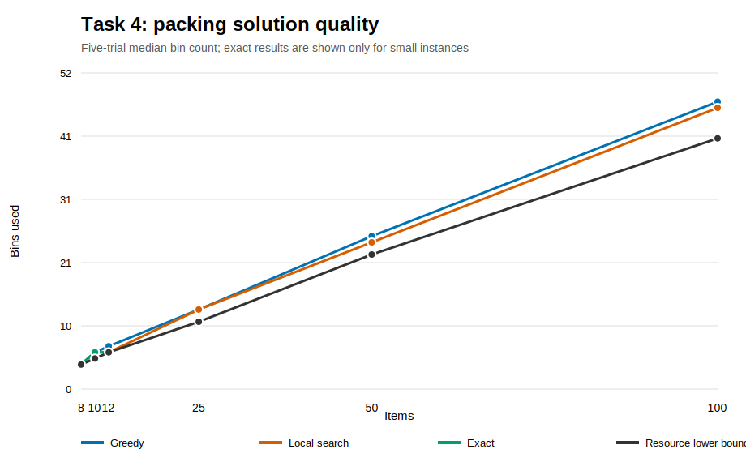
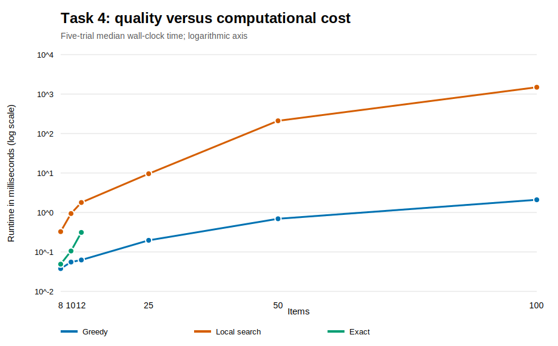
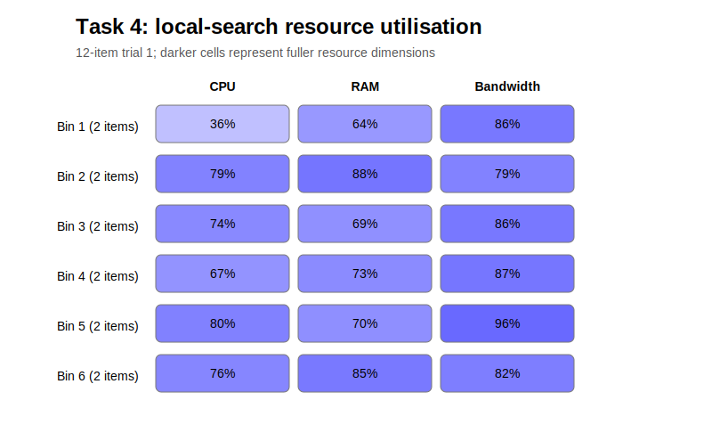

# Task 4 - NP-Hard Problem and Heuristics

## Problem Selection and NP-Hardness

The selected problem is multi-dimensional bin packing. Each workload item requires CPU, RAM, and
bandwidth. Every server bin has a capacity in each dimension, and the objective is to minimise the
number of servers while satisfying all three limits.

The problem is NP-hard by restriction from one-dimensional bin packing. Given a one-dimensional
instance with item sizes `s(i)` and capacity `B`, create a three-dimensional item
`(CPU=s(i), RAM=1, bandwidth=1)`. Give each bin capacities `(B, n, n)`, where `n` is the number of
items. RAM and bandwidth can never be the limiting dimensions, so a feasible packing into `k`
three-dimensional bins exists exactly when the original instance fits into `k` one-dimensional bins.
An optimiser for this restricted multi-dimensional problem would therefore solve one-dimensional bin
packing. Because that special case is NP-hard, the general three-dimensional problem is NP-hard.

## Greedy Construction

Best-fit decreasing first ranks each item by its largest normalised demand:

```text
dominant_share(i) = max(cpu_i / CPU, ram_i / RAM, bandwidth_i / BANDWIDTH)
```

It places the item into the feasible existing bin with the smallest squared normalised residual, or
opens a new bin. Sorting costs O(n log n). Testing up to n bins for every item gives O(n squared) worst
case. The hidden constant includes three capacity checks and residual calculations per candidate bin.

The heuristic is deterministic but not optimal. For capacity `(10,10,10)`, the items
`(6,2,2)`, `(4,8,1)`, `(4,2,8)`, and `(6,1,2)` are greedily packed into three bins. The pairings
`[(6,2,2),(4,2,8)]` and `[(4,8,1),(6,1,2)]` prove that two bins suffice.

## Relocate-and-Swap Local Search

Local search starts from the greedy result and repeatedly applies two neighbourhoods:

1. Select a lightly populated bin and use a small backtracking search to relocate all of its items into
   the remaining bins. A successful move removes one bin.
2. If no bin can be removed, swap pairs of items between bins when the swap is feasible and reduces
   cross-resource imbalance.

Search stops at a local optimum or after a configurable pass limit. The procedure cannot increase bin
count, but it has no global optimality guarantee. Relocation can itself be exponential in the number of
items being moved; in practice it targets small bins first.

The four-item counterexample is repaired from three bins to two, demonstrating why a neighbourhood
method can reverse an early greedy decision.

## Exact Reference and Evaluation

For small instances, branch-and-bound orders items by dominant share, uses the greedy packing as an
initial upper bound, prunes branches that cannot improve it, and removes symmetric choices having
identical bin loads. The maximum dimension-wise volume bound is:

```text
LB = max(
    ceil(total_CPU / CPU_capacity),
    ceil(total_RAM / RAM_capacity),
    ceil(total_bandwidth / bandwidth_capacity)
)
```

Reaching this lower bound proves optimality. The solver remains exponential and is used only for 8,
10, and 12 items. Larger results are compared with the lower bound but are not falsely labelled
optimal.



On trial 1 with 12 items, greedy used seven bins while local search and the exact solver used six.
Across larger instances, local search sometimes removes a bin, but improvements are instance-dependent.
The resource lower bound can be below the true optimum because it ignores incompatible combinations.



The trade-off is clear: greedy construction takes fractions of a millisecond, while local search pays
for many feasibility checks and relocation branches. On the 100-item trial-1 instance, greedy took
about 2.1 ms and local search about 1.49 seconds, yet both used 48 bins. Extra computation therefore
does not guarantee a better solution.



The heatmap shows each resource dimension separately. A bin can appear full in CPU but have spare RAM
and bandwidth; this fragmentation is precisely why summing demands into one scalar would lose
important feasibility information.

## Critical Evaluation

Greedy construction is the appropriate fast baseline and produces a feasible answer predictably.
Local search is worthwhile when one fewer server has high operational value and more computation is
acceptable. The exact solver provides strong evaluation evidence but cannot scale to realistic
instances.

Five deterministic trials are reported for sizes 8, 10, 12, 25, 50, and 100. Raw data contains bin
count, lower bound, certified gap where exact results exist, runtime, evaluated moves, and accepted
moves. Limitations include synthetic uniform demands, a single capacity type, and modest trial count.
Future evaluation could add correlated workloads, heterogeneous servers, GRASP or simulated annealing,
time-limited exact optimisation, and confidence intervals.

## Reproduction

```powershell
$env:PYTHONPATH='src'
python -m unittest discover -s tests -p 'test_*.py' -v
python experiments/task4_experiments.py --trials 5
python experiments/task4_figures.py
```

Raw evidence is stored in `experiments/data/task4_experiments.csv`.
