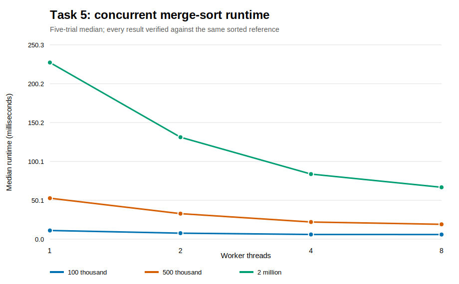
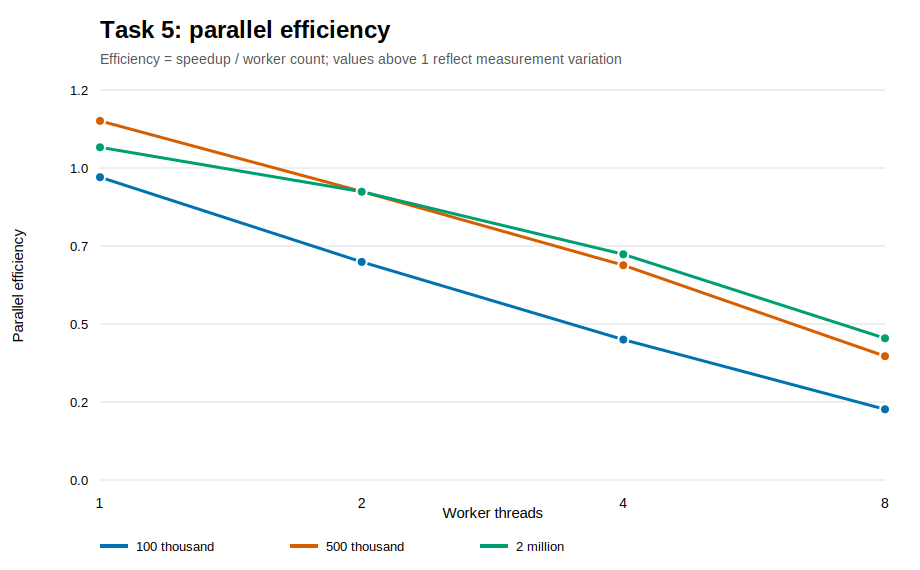

# Task 5 - Concurrent Programming

## Design

The selected earlier algorithm is merge sort. Both versions use bottom-up merge passes and O(n)
auxiliary storage:

- Sequential: execute every merge in the calling thread.
- Concurrent: batch the disjoint merges in each pass across a fixed worker pool, wait for the pass to
  finish, swap source/destination arrays, and continue with doubled run width.

The algorithm performs O(n log n) total work and uses O(n) additional space. Parallel execution does
not change the work bound. It aims to reduce elapsed time by completing independent merges
simultaneously.

Java 17 threads are used as the permitted equivalent threading library. A custom queue makes
synchronisation visible rather than hiding it inside a framework.

## Critical Sections and Synchronisation

The shared queue, `pendingTasks` counter, and shutdown flag form the critical section. A
`ReentrantLock` protects all three.

- `workAvailable` is a condition variable on which idle workers wait. Submission signals one worker;
  shutdown signals all.
- `allDone` is a second condition. The coordinator waits while pending work is non-zero; the last
  finishing worker signals completion.
- Worker shutdown is followed by `join`, ensuring all threads terminate cleanly.

The large source and destination arrays do not require a mutex. During one pass, every task reads the
same immutable source array and writes to a mathematically disjoint destination range. The coordinator
does not swap arrays until `allDone` is signalled. Lock release/acquisition provides the required
visibility boundary between workers and the next pass.

Tiny merge operations are batched: at most one task per worker is queued for a pass, and each task
processes strided merge ranges. This reduces queue locking and condition signalling without allowing
two workers to write the same range.

## Correctness Checks

Tests cover:

- empty and single-element arrays;
- duplicates, negative values, and integer extremes;
- non-power-of-two sizes;
- 1, 2, 4, and 8 workers;
- deterministic random arrays up to 10,003 elements;
- invalid arguments.

Every benchmark run is also compared element-for-element with the platform's trusted sorted reference
and checked for monotonic order. Incorrect results abort the experiment instead of producing a timing
row.

## Performance Method

Datasets contain 100,000, 500,000, and 2,000,000 deterministic random 64-bit integers. The runtime is
warmed up before measurement. For each size, sequential and 1/2/4/8-worker configurations run five
times. Execution order rotates between trials to reduce systematic warm-cache or thermal bias. Input
copying and reference generation occur outside the timed region.

Speedup and efficiency are:

```text
speedup(p) = median sequential time / median concurrent time with p workers
efficiency(p) = speedup(p) / p
```



Larger inputs amortise thread coordination better. Median 2-million-element runtime falls from about
233 ms sequentially to 228, 131, 84, and 67 ms with 1, 2, 4, and 8 workers respectively.


At 100,000 elements, eight workers achieve only about 1.74x speedup. At two million elements, eight
workers reach about 3.49x. The ideal line is deliberately shown to make the scaling gap visible.



Efficiency falls as worker count rises: for two million elements it is approximately 0.89 at two
workers, 0.69 at four, and 0.44 at eight. A one-worker ratio can slightly exceed one because the two
code paths have different queue overhead and timings are noisy; it is not super-linear parallelism.

## Scalability Limits

The observed limits are:

- Queue locking and condition signalling on every merge pass.
- Thread creation and joining once per sort.
- Cache coherence and memory-bandwidth pressure while workers scan two arrays.
- Load imbalance when the number of merges is not divisible by the worker count.
- The final merge pass contains only one merge, so it cannot use multiple workers.
- Allocation and garbage-collection effects.
- Other processes and operating-system scheduling.

The serial final merge is especially important under Amdahl's law: adding workers cannot accelerate
that portion. Parallelising within a single large merge or using a multiway merge could reduce the
span, but would add partitioning and coordination complexity.

The results demonstrate speedup, not perfect scalability. Reporting wall-clock medians alongside the
O(n log n) bound is essential because Big-O does not predict lock cost, cache behaviour, or the
crossover point where threads become worthwhile.

## Reproduction

```powershell
powershell -NoProfile -ExecutionPolicy Bypass -File task5_concurrency/run_tests.ps1
powershell -NoProfile -ExecutionPolicy Bypass -File task5_concurrency/run_benchmark.ps1 -Trials 5
python experiments/task5_figures.py
```

Raw evidence is stored in `experiments/data/task5_benchmarks.csv`.
